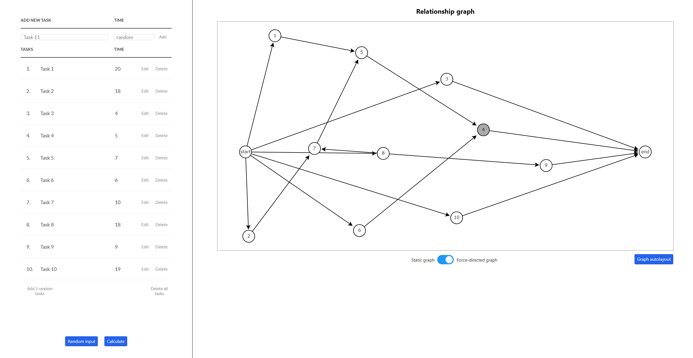
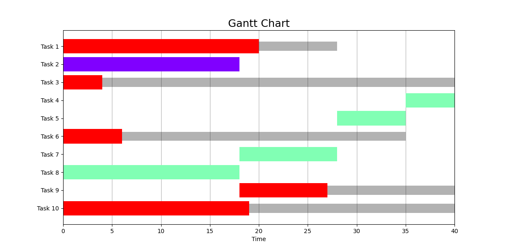

# Gantt chart web app

[Link to the app](link-to-demo)

CPM (*critical path method*) is a project management algorithm used for scheduling complex projects. You must identify the tasks necessary for completing the project and estimate the time required for each. Then, you determine the dependencies between tasks (e.g., task C cannot begin until tasks A and B are finished). The algorithm provides you with time windows for completing each task and, crucially, critical path - a sequence of tasks that cannot be delayed without affecting the overall completion date of the project. Both of them can be visualized on the Gantt Chart.

## How to use the app?
1. Add the tasks. They will appear also on the relationship graph.
2. Establish the dependencies between predecessor and successor tasks by connecting them. This must result in creating a directional acyclic graph.
3. Click the 'Calculate' button.
4. *Voilà!* Here is your Gantt Chart.

**Playing with the generate random input button is highly welcomed.**

The app provides two modes for displaying graphs, each with different layout algorithms. The first one uses a force-based approach, in which the graph responds dynamically to its structure changes, trying to find optimal layout in the real time, while the second one leaves it to the user's desire. Regardless, it is always possible to auto-layout the graph. 

## Reflections after finishing the project
* JavaScript - easy to write, HARD to debug. There's something immensely impressive in a technology that runs the Web despite an infinite number of things that are prone to fail, yet dealing with all the 'null's and 'undefined's, not to mention all the peculiar results of adding, comparing and more variables of different types gave me a headache. Once in order to iterate through an array instead of a 'for of' loop i wrote a 'for in' loop (Python habits, of course). Apparently, the code haven't shown any signs of trouble - no syntax errors, no exceptions at runtime. JavaScript makes things work at any cost, so that the end user doesn't notice. Well, let's be grateful TypeScript exists and helps to mitigate some of the ambiguity issues.
* Graph auto-layout algorithms are quite tricky to get right. There will always be a significant portion of edge cases that break the algorithm. The force-based approach seems like the best, most all-rounded option out there with a beautful idea behind it. To be honest, at first I wasn't satisfied with the results, but seeing this algorithm do well on basically all 'reasonably looking' graphs got me convinced. The other, more 'classical' approach looks less chaotic in exchange for the amount of crossing edges - it's a fair tradeoff. Honestly, both of them are good. Use what looks more appealing to your taste.
* Overall I'm satisfied with the result. There was a lot of diving into and modyfing the springy.js framework to make it interactive, not to mention adding both auto-layout algorithms - it was the real challenge here.

## Context of creating the app
Ever since I heard about Pyscript (it's a framework that allows to run Python programs in the browser) I wanted to utilize one of many algorithms written for a university assignment. should know that I enjoy making things work with little prior knowlegde of how things are done and figure it out on the fly, The JavaScript landscape was foreign to me at that time, but I figured out a plan how to create a desired app. I decided to pick a nice-looking TODO-list and a convinient yet simple interactive graph interface in JS, than combine them with CPM algorithm to generate Gantt Charts (in fact it is PERT under the hood, but I simplified the problem). I assembled a working prototype within a few days. To add random input, auto-layout and some playability - that's a much longer story.

### References
* https://github.com/dhotson/springy
* https://codepen.io/franklynroth/pen/ZYeaBd
* https://dev.to/nyxtom/drawing-interactive-graphs-with-canvas-and-javascript-o1j
* https://crinkles.io/writing/auto-graph-layout-algorithm